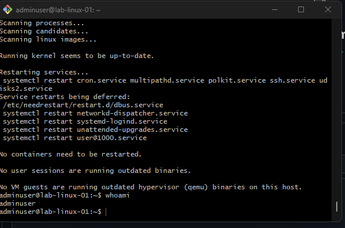
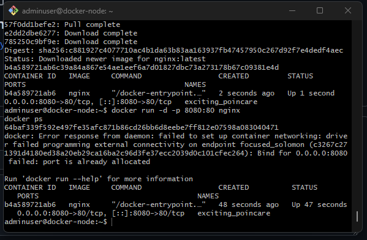
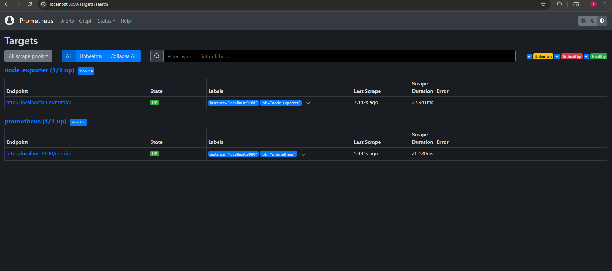
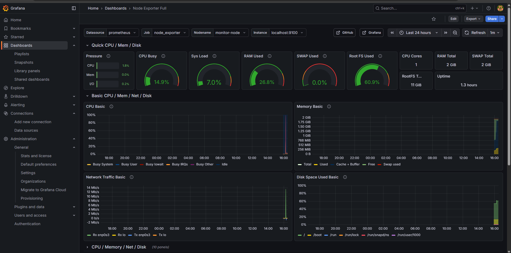

# DevOps / SRE Homelab

A hands-on Site Reliability Engineering homelab built to simulate real-world infrastructure, containerization, and monitoring workflows.

This project demonstrates practical experience with Linux administration, Docker, Prometheus, and Grafana in a multi-node environment.

---

## 🧱 Architecture Overview


---

## 🏗️ Architecture Overview
```
Windows Host (VirtualBox)
│
├── infra-node (Ubuntu Server)
│ ├── Linux users & permissions
│ └── SSH & networking
│
├── docker-node (Ubuntu Server)
│ ├── Docker & Docker Compose
│ ├── Nginx container
│ └── Application networking
│
└── monitor-node (Ubuntu Server)
├── Prometheus
├── Node Exporter
└── Grafana
```

---

---

## 🛠️ Technologies Used

- Ubuntu Server 22.04 LTS
- Docker & containerd
- Nginx
- Prometheus
- Node Exporter
- Grafana
- VirtualBox
- Linux systemd services
- NAT networking & port forwarding

---

## 🔐 Remote Access (SSH)

Secure SSH access configured using NAT port forwarding.



---

## 🐳 Docker & Containerization

Docker installed via the official Docker repository.  
Nginx container deployed and exposed via port mapping.



---

## 📊 Monitoring with Prometheus

Prometheus configured to scrape:
- Itself
- Node Exporter metrics

All targets reporting **UP**.



---

## 📈 Visualization with Grafana

Grafana configured with Prometheus as a data source.  
Node Exporter Full dashboard imported to visualize system metrics.



---

## 🎯 Key Skills Demonstrated

- Linux server provisioning and administration
- Secure remote access via SSH
- Containerization using Docker
- Service monitoring and observability
- Metrics collection and visualization
- Troubleshooting networking and services
- Infrastructure documentation

---

## 📌 Future Improvements

- Add Docker Compose workloads
- Monitor docker-node via Node Exporter
- Add alerting with Alertmanager
- Introduce CI/CD pipelines
- Simulate failure and recovery scenarios

